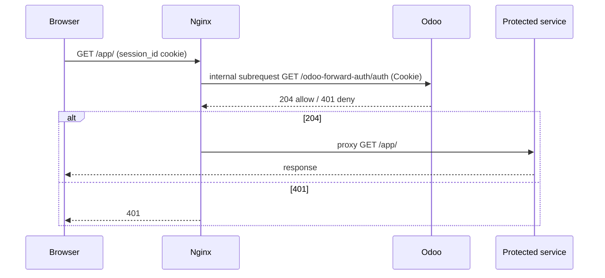

# odoo-forward-auth

Use your existing **Odoo session** to gate any internal HTTP service behind an
Nginx `auth_request` check. Odoo answers a per-request authorization subrequest;
Nginx proxies or denies. No OIDC, no SAML, no change to the protected service.

> This is *not* real SSO. It reuses Odoo's session as the source of identity and
> adds no authentication factor. If you already run an OIDC/SAML provider, use
> that instead. See [docs/security.md](docs/security.md).

Use this only for applications trusted as highly as Odoo: the example shares
Odoo's browser origin, so an XSS in the protected application can act as the
visiting Odoo user. See the [trust boundary](docs/security.md#browser-origin-is-a-trust-boundary).

## How it works

1. The browser requests a path under the protected prefix, sending its Odoo
   `session_id` cookie.
2. Nginx sends an **internal** subrequest to the Odoo authorization endpoint,
   forwarding the cookie and stripping the body.
3. Odoo loads the session and checks the "internal user" condition and
   membership of the configured group. It answers `204` or `401`; with no group
   configured, every request is denied.
4. On `204` only, Nginx proxies the original request to the protected upstream.

## Repository layout

- `odoo_forward_auth/` — installable Odoo 18 addon with the authorization route.
- `examples/` — annotated Nginx configuration.
- `docs/` — [how it works](docs/how-it-works.md),
  [Nginx reference](docs/nginx.md),
  [security](docs/security.md).

## Quickstart

1. Install the addon and set the authorized group in
   **Settings > General Settings > Forward Auth**.
2. Add `examples/nginx-forward-auth-http.conf` in Nginx's `http` context and
   `examples/nginx-forward-auth.conf` inside your Odoo `server` block, adjusting
   the upstreams and prefix. Review the [deployment requirements](docs/nginx.md#deployment-requirements).
3. `nginx -t && systemctl reload nginx`.
4. Visit the protected prefix with an Odoo session that belongs to the group.

## Compatibility

Built and tested on **Odoo 18.0**. Use the branch that matches your Odoo series:
`16.0`, `17.0`, `18.0`, `19.0`. Other versions are untested.

## Tests

Run `sh tests/integration/run.sh` with Docker and Docker Compose installed.
The [integration harness](tests/integration/README.md) installs the addon into a
fresh database and checks the shipped proxy configuration. CI runs the same command.

## License

AGPL-3.0. See [LICENSE](LICENSE).
